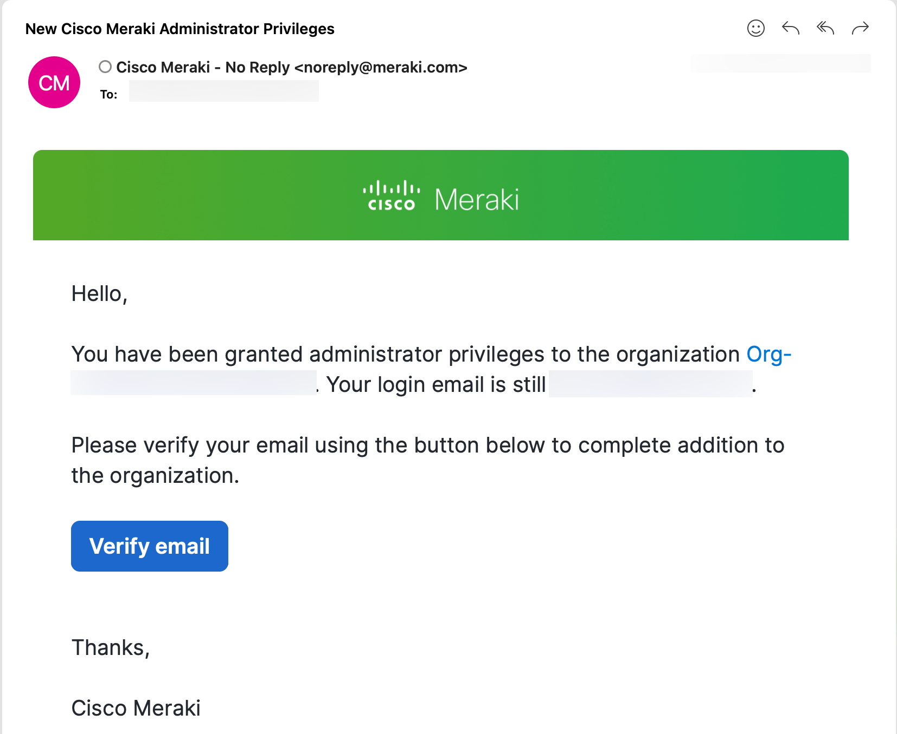
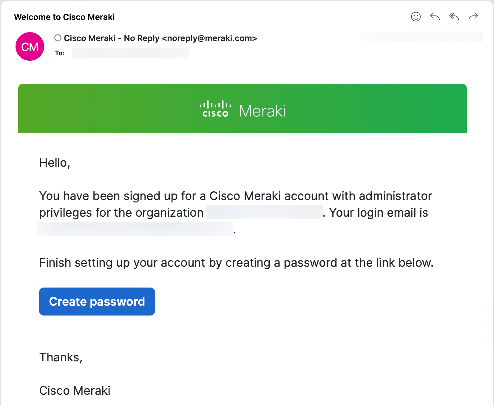
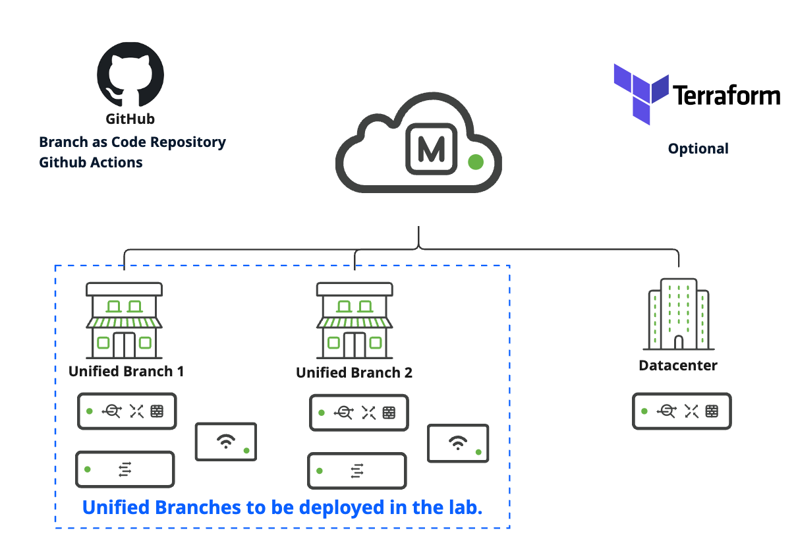

<!-- 

  

    <h2 style="margin-bottom:0.5rem;">🔒 Private Preview</h2>
    
This lab guide is currently in private testing. Please enter the access password to continue.

    <input type="password" id="pwd-input" placeholder="Enter password" style="padding:0.6rem 1rem;width:100%;box-sizing:border-box;margin-bottom:0.75rem;font-size:1rem;border:1px solid #ccc;border-radius:4px;">
    <button onclick="checkPassword()" style="padding:0.6rem 2rem;background:#1565c0;color:#fff;border:none;border-radius:4px;font-size:1rem;cursor:pointer;width:100%;">Access Lab</button>
    
Incorrect password. Please try again.

  

 -->

# Unified Branch - Branch as Code

---

## What You Will Learn

This lab introduces **Unified Branch - Branch as Code (BaC)** — an approach to managing [**Unified Branch**](https://www.cisco.com/site/us/en/solutions/networking/campus-branch-networking/unified-branch/index.html?dtid=osscdc000283&linkclickid=srch) network infrastructure declaratively using YAML files, Terraform, and CI/CD automation. You will use a real Cisco lab environment managed through Meraki Dashboard. 

The lab is organized into two parts:

| | Part A | Part B |
|---|---|---|
| **Title** | Branch as Code with GitHub Actions CI/CD | Branch as Code Step By Step with Terraform |
| **Required?** | ✅ Required | ⚙️ Optional |
| **Local installs** | None — runs entirely in the cloud | Terraform, Git, Python on your laptop |
| **What you do** | Fork the repo, configure secrets, understand the BaC data model, trigger automated CI/CD pipelines, run validation and integration tests | Clone the repo locally, understand the BaC data model, and deploy branch networks directly from your terminal |

!!! warning "Note"
    **Start with Part A.** It is the primary lab experience and requires nothing installed on your laptop — just a GitHub account and a browser.

    Part B is an optional deep-dive for learners who want hands-on experience running Terraform locally. It requires the environment to be reset first — confirm with your proctor before starting.

---

## How to Read the Lab Guide

!!! danger "Important"
    Critical instructions — skipping or misreading them could break your lab or affect a production environment.

!!! warning "Note"
    Warnings and reminders — things that are easy to overlook.

!!! tip "Hint"
    Helpful tips, shortcuts, or pointers to make the lab easier.

!!! info "Information"
    Extra context, background, or links to official documentation.

---

## Lab Access — BYOA Model

This lab uses the **Bring Your Own Account (BYOA)** model. You will use your own Meraki Dashboard account and your own API key throughout both labs. **Cisco does not store or manage your credentials.**

If the email you used for the lab reservation is associated with an existing Dashboard account, you should have received a notification that new **Cisco Meraki administrator privileges** have been granted to your account. Follow the instructions in the email to accept the invite.

If this is your first time accessing Meraki Dashboard with this email, the message will guide you to create a password.

!!! danger "Important"
    If your Meraki Dashboard account is also associated with other organizations — especially production environments — **DO NOT** perform any steps in this guide on your own organization. Only work within the provided lab organization, which follows the naming pattern **"Org-[org_id]"**. To confirm you are in the right org, navigate to **Organization > Administrators** and verify that you see an admin named **ENLS** with the email **launchpad-labs-ops@cisco.com**.

---

## Lab Topology

Your lab pod includes the following Meraki hardware:

| Location | Device | Role |
|----------|--------|------|
| Datacenter | MX85 | Pre-configured by proctor; your VPN hub |
| Branch 1 | MX85 + MS250 + CW9172H | Deployed by you in this lab |
| Branch 2 | MX85 + MS250 + CW9172H | Deployed by you in this lab |

In both labs, you will use automation to create the **Unified Branch 1** and **Unified Branch 2** networks inside your existing lab organization, claim the physical devices, and configure them with the BaC data model.

---

## What Is Branch as Code?

!!! info "Information"
    **Branch as Code (BaC)** extends Infrastructure as Code (IaC) principles to Cisco Unified Branch network configuration and policy management. Instead of clicking through a GUI, you describe your desired network state in YAML files, and automation tools translate those files into Meraki API calls that configure your devices. BaC uses Terraform and a curated set of YAML data model files to provision network infrastructure consistently across many branch sites.

    Learn more at [netascode.cisco.com](https://netascode.cisco.com){:target="_blank"} and the [Cisco Unified Branch CVD](https://www.cisco.com/c/en/us/td/docs/solutions/CVD/Campus/Cisco_Unified_Branch_Small_Branch.html){:target="_blank"}.

    **Note**: In this lab, we are using a different switch model that is outside the CVD scope. However, the learning experience for Branch as Code remains the same.

---

## Prerequisites

### For Both Labs

Before starting, make sure you have:

- A **Meraki Dashboard account** (you will receive an email invite when the lab pod is provisioned)
- A **GitHub account** at [github.com](https://github.com)

### Part A — No Additional Installs Required

Part A runs entirely in GitHub Actions (cloud-hosted runners). You only need a browser and your GitHub account.

### Part B — Local Tools Required

Part B requires the following tools installed on your laptop:

| Tool | Minimum Version | Install |
|------|----------------|---------|
| **Terraform** | 1.9 or later | [developer.hashicorp.com/terraform/downloads](https://developer.hashicorp.com/terraform/downloads) |
| **Git** | Any recent version | [git-scm.com](https://git-scm.com) |
| **Python** | 3.11 or later | [python.org](https://www.python.org/downloads/) |

!!! info "Environment variables"
    The lab repository includes a `.env.example` template. When the lab asks you to configure environment variables, start by copying that file and renaming the copy to `.env`, then update the values in `.env` to match your lab environment.

<!-- !!! tip "Hint"
    On macOS: `brew install terraform git python` -->

---

## Ready to Start?

**Proceed to [Part A — Branch as Code with GitHub Actions CI/CD](PART-A-CICD.md).**

When you have completed Part A and want to go further, continue to [Part B — Branch as Code with Terraform](PART-B-TERRAFORM.md).

---

  <a href="PART-A-CICD/" style="display:inline-block;padding:0.6rem 1.5rem;background:#1565c0;color:#fff;border-radius:4px;text-decoration:none;font-family:inherit;font-size:inherit;">
    Part A - Branch as Code with GitHub Actions &nbsp;→
  </a>

