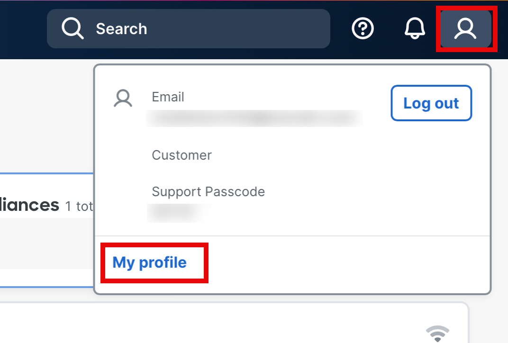
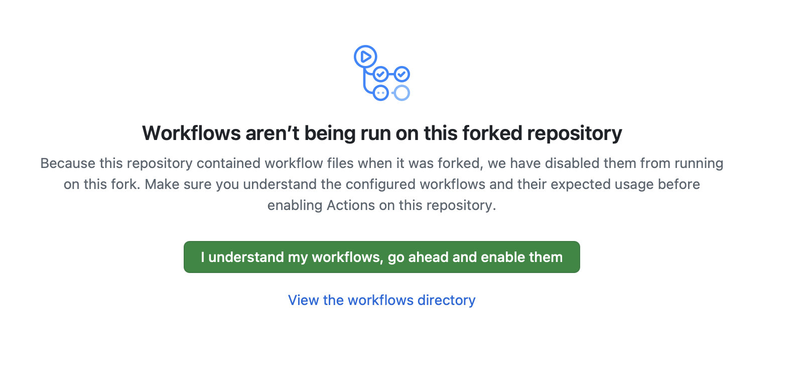

# Part A — Branch as Code with GitHub Actions CI/CD

In this lab, you will use [GitHub Actions](https://docs.github.com/en/actions) to deploy and validate two Unified Branch networks — entirely from the cloud, with no software installed on your local machine. You will trigger a full CI/CD pipeline, explore each automated stage, and deliberately introduce configuration errors to see the pipeline catch them.

!!! info "What you need"
    - A **GitHub account** (free tier is fine)
    - Your **Meraki Dashboard account** and lab organization access
    - A **browser** — that's it

---

## Learning Objectives

By the end of Part A, you will be able to:

- Fork a Branch as Code repository and configure it for your lab pod
- Store API key securely in GitHub and understand how it flow into CI/CD pipelines
- Understand the BaC YAML data model — pods variables, templates, and the `!env` tag
- Trigger and observe a multi-stage GitHub Actions pipeline (Validate → Plan → Deploy → Idempotency Test / Integration Test)
- Read pipeline artifacts including the merged NaC configuration and Terraform plan
- Run syntax and semantic validation workflows and understand pass/fail behavior
- Understand how scheduled integration tests enable continuous Day-2 drift detection

---

## Pipeline Overview

The full CI/CD pipeline runs these stages in sequence:

```
┌──────────┐   ┌──────┐   ┌────────┐
│ Validate │ → │ Plan │ → │ Deploy │
└──────────┘   └──────┘   └────────┘
                         ↙          ↘
          ┌──────────────────┐   ┌──────────────────┐
          │ Idempotency Test │   │ Integration Test │
          └──────────────────┘   └──────────────────┘
```

| Stage | What it does |
|-------|-------------|
| **Validate** | Checks Terraform formatting, generates `merged_configuration.nac.yaml`, and runs `nac-validate` against the NaC schema |
| **Plan** | Runs `terraform plan` and saves the plan — shows exactly what will be created/changed |
| **Deploy** | Runs `terraform apply` using the saved plan — creates the branch networks and claims the hardware |
| **Idempotency Test** | Runs a post-deploy `terraform plan -detailed-exitcode` and fails if drift or unintended changes are detected |
| **Integration Test** | Runs Robot Framework tests against the live Meraki Dashboard to verify the deployed config matches the data model, using `nac-test` |

[nac-validate](https://github.com/netascode/nac-validate/tree/main) and [nac-test](https://github.com/netascode/nac-test) are tools used within Cisco's Branch as Code (BaC) framework to ensure network configuration integrity and operational correctness through automated validation and testing.

---

## Step 1 — Log In and Identify Your Lab Organization

1. Open [https://dashboard.meraki.com](https://dashboard.meraki.com) and sign in with the email address from your lab reservation.

2. If your account has access to multiple organizations, click the organization name in the top-left corner and select the lab organization — it follows the naming pattern **Org-[org_id]**.

    !!! danger "Important"
        To confirm you are in the correct lab org, navigate to **Organization > Administrators**. You should see an admin named **ENLS** with the email **launchpad-labs-ops@cisco.com**.

<!-- 3. Note down your full organization name (e.g. `Org-3665367146726165048`) — you will need it in Step 4. -->

---

## Step 2 — Read Serial Numbers from Network Notes

The Launchpad Labs chatbot has already loaded your branch hardware serial numbers into the **Network notes** field of the Datacenter network.

1. In the Dashboard, navigate to the **Datacenter** network.

2. Navigate to **Network-wide > General** and scroll to the **Network notes** field.

3. You should see your lab organization name and serial numbers for branches in this format:

    ``` { .bash .no-copy }

        #Copy and paste the following into .env of your git repository.
        org_name=Org-XXXXXXXXXXXXXXXXXXX

        # ── Device serials (per-branch)
        #
        branch1_mx_serial=XXXX-XXXX-XXXX
        branch1_ms_serial=XXXX-XXXX-XXXX
        branch1_cw_serial=XXXX-XXXX-XXXX
        branch2_mx_serial=XXXX-XXXX-XXXX
        branch2_ms_serial=XXXX-XXXX-XXXX
        branch2_cw_serial=XXXX-XXXX-XXXX
    ```

4. Copy the entire note — you will paste them into the `.env` file in Step 4.

    !!! danger "Important"
        Devices can only be claimed into one organization at a time. Use only the serial numbers assigned to your lab pod and only claim them to your lab organization.

---

## Step 4 — Fork the Repository

Forking creates your own copy of the lab repo under your GitHub account. This is where you will store your secrets, configure your lab pod details, and trigger workflows.

1. Go to the lab repository:

    ```
    https://github.com/snmitrov/bac-lab.git
    ```

2. Click **Fork** (top-right corner of the page).

3. On the fork screen, leave all defaults and click **Create fork**.

    !!! info "Information"
        Your fork will be at `https://github.com/YOUR_GITHUB_USERNAME/bac-lab`. All subsequent steps happen in your fork — not the original repo.

---

## Step 5 — Generate Your Meraki API Key

The pipeline authenticates to Meraki using a personal API key tied to your dashboard account. Follow these steps to generate one. **If you already have an API key for your lab account, skip this step.**

1. In the Meraki Dashboard, click your **profile icon** in the top-right corner and select **My profile**.

    { width="60%" }

2. Scroll down to the **API access** section and click **Generate new API key**. 

3. Copy the key immediately and save it somewhere safe (e.g. a password manager). **It will only be displayed once** — if you navigate away without copying it, you will need to revoke it and generate a new one.

    { width="60%" }

    !!! warning "Keep your API key private"
        Your API key has the same access level as your dashboard login. Never share it, commit it to a repository, or paste it into chat. You will store it securely as a GitHub Secret in the next step.

---

## Step 6 — Add Your Meraki API Key as a GitHub Secret

The pipeline reads your API key from a GitHub Secret — an encrypted value that GitHub injects into workflow runs at runtime. It is never stored in the repository files.

1. In your fork, click **Settings** (top navigation tab).

2. In the left sidebar, go to **Secrets and variables > Actions**.

3. Click **New repository secret** and set:

    | Field | Value |
    |-------|-------|
    | **Name** | `MERAKI_API_KEY` |
    | **Secret** | Your Meraki API key |

4. Click **Add secret**.

    !!! info "How the pipeline uses it"
        The workflow file references `${{ secrets.MERAKI_API_KEY }}` and injects it as `MERAKI_API_KEY`, `MERAKI_DASHBOARD_API_KEY`, and `TF_VAR_meraki_api_key` — all three environment variables that the Terraform provider and NaC module require.

---

## Step 7 — Configure Your Lab Pod Details in .env

The repo includes a `.env.example` template. Create a `.env` file from that template, then update the values to match your lab environment. The `.env` file at the root of the repo stores non-secret variables that the pipeline loads at runtime: your org name, serial numbers, and hub network name. Unlike the API key, these are committed to the repo.

1. In your fork on GitHub, open `.env.example` and copy its contents.

2. Create a new file named `.env` in the root of your fork by copying `.env.example`:
    - In `.env.example`, click **Raw** and copy all content.
    - Return to the repo root and click **Add file > Create new file**.
    - Name the file exactly `.env`, paste the copied content, and then update the values for your lab pod:

    ``` { .bash .no-copy }
    #Copy and paste the following into .env of your git repository.
    org_name=Org-XXXXXXXXXXXXXXXXXXX

    # ── Device serials (per-branch)
    #
    branch1_mx_serial=XXXX-XXXX-XXXX
    branch1_ms_serial=XXXX-XXXX-XXXX
    branch1_cw_serial=XXXX-XXXX-XXXX
    branch2_mx_serial=XXXX-XXXX-XXXX
    branch2_ms_serial=XXXX-XXXX-XXXX
    branch2_cw_serial=XXXX-XXXX-XXXX
    ```

3. Click **Commit changes**. Use the default commit message and commit directly to `main`.

    !!! warning "Note"
        Notice that the API key is **not** in this file. The `.env` file only holds non-sensitive variables. The API key lives exclusively in GitHub Secrets.

    !!! tip "Hint"
        Keep `.env.example` unchanged as your reference template. Only update the values in `.env`.


---

## Step 8 — Create a GitHub Environment

The **Plan** and **Deploy** jobs reference a GitHub Environment for scoped secrets and optional approval gates.

1. In your fork, go to **Settings > Environments**.

2. Click **New environment**, enter the name **`unified-branch-network-as-code`** (copy it exactly as shown below), and click **Configure environment**.

    ```
    unified-branch-network-as-code
    ```

    !!! danger "Important"
        The environment name must be **exactly** `unified-branch-network-as-code` — no extra spaces, no different casing. The pipeline workflow file (`pipeline.yml`) hardcodes `environment: unified-branch-network-as-code` in the Plan, Deploy, and Integration Test jobs. If the environment does not exist in your repo settings under this exact name, those jobs will fail waiting for an environment that GitHub cannot find.

3. Leave Deployment branches and tags with **No restriction**.

    !!! info "Information"
        Notice the **Deployment branches and tags** setting on this page. By default, all branches and tags are allowed to trigger a deployment to this environment. In a real-world pipeline you would restrict this — for example, allowing only the `main` branch to deploy to production. This prevents feature branches from accidentally deploying infrastructure changes.


---

## Step 9 — Run the Deploy Pipeline

You are now ready to trigger the full CI/CD pipeline.

1. In your fork, click the **Actions** tab.

    !!! warning "Enable Workflows in Your Fork"
        GitHub **disables workflows by default** in forked repositories. When you first visit the **Actions** tab you will see a banner stating *"Workflows aren't being run on this forked repository"*. Click the **"I understand my workflows, go ahead and enable them"** button to activate them.

        

2. In the left sidebar, click **Deploy Small Branch as Code**.

3. Click **Run workflow** (top-right dropdown), keep `main` branch selected, and click **Run workflow**.

4. Monitor the workflow status changes for each stage. 
<!-- Refresh the page and click on the new workflow run to open it. -->

### Follow Each Stage

As the pipeline runs, expand each job to observe what is happening:

**Validate:**

- `terraform fmt -check` verifies all Terraform files are correctly formatted
- Terraform generates `merged_configuration.nac.yaml`
- `nac-validate` validates the merged configuration against the BaC schema
- Look for `✅ nac-validate passed` in the output
- Download the `plan-outputs` artifact to review `plan.txt` / `plan.json`

**Plan:**

- `terraform plan` shows exactly what will be created: two networks (`Unified Branch 1` and `Unified Branch 2`), device claim resources, VLANs, firewall rules, SSIDs, switch profiles, and more
- Download the `plan-outputs` artifact to review `plan.txt` / `plan.json`

**Deploy:**

- `terraform apply` executes the plan — this is where the Meraki API calls happen
- The two branch networks are created and your physical MX85, MS250, and CW9172H devices are claimed

    !!! warning "Note"
        On your **first run** you will see a yellow warning step inside the Deploy job: `Unable to download artifact(s): Artifact not found for name: terraform-state-pre-deploy`. This is expected — no prior Terraform state exists yet, so there is nothing to restore. The step is configured with `continue-on-error: true` and the Deploy job will still show a green ✅. This warning disappears on all subsequent runs once a state file exists.


**Idempotency Test:**

- Runs immediately after Deploy and executes `terraform plan -detailed-exitcode`
- Passes only when no changes are detected (exit code `0`)
- Fails if Terraform reports pending changes (exit code `2`), signaling non-idempotent behavior


**Integration Test:**

- Robot Framework (`nac-test`) runs test cases against the live Meraki Dashboard
- Look at the **Job Summary** for a pass/fail count table
- Download `integration-test-results` and open the HTML report in your browser for the full test output

!!! warning "Note"
    The full pipeline typically takes **5–10 minutes**. Do not close the tab — watch each job complete in sequence.

!!! info "Node.js Deprecation Warnings"
    You may see yellow warning annotations mentioning that **Node.js 20** actions are deprecated. These warnings come from GitHub-hosted runner updates and do **not** affect the pipeline results. They can be safely ignored.

---

## Step 10 — Verify in the Meraki Dashboard

1. Return to [https://dashboard.meraki.com](https://dashboard.meraki.com) and confirm you are in the lab organization.

2. In the network selector, you should now see:
    - **Unified Branch 1**
    - **Unified Branch 2**

3. Select **Unified Branch 1** and verify:
    - **Network-wide > General** — time zone matches the data model
    - **Security & SD-WAN > Addressing & VLANs** — Data, Voice, IoT, Guest, and Infra VLANs present
    - **Wireless > SSIDs** — Data and Guest SSIDs configured
    - **Security & SD-WAN > Site-to-site VPN** — scroll down to confirm the network address/subnet is set correctly (e.g. matches the VLAN subnets from the data model)
    - **Security & SD-WAN > VPN Status**  — status of remote VPN peer Datacenter should be in green
    - **Security & SD-WAN > Appliance Status**, then navigate to **Tools > Ping**, configure the following and click `Ping`. You should see successful ping proving the VPN tunnel is up between branch and datacenter.
        - Source IP Address: `VLAN 10`
        - Destination IP Address: `10.255.20.1` (Gateway IP for Voice VLAN on Datacenter side)
    !!! note
        The VPN connectivity between branch networks and Datacenter might take a couple minutes.

    !!! tip "Compare with the Data Model"
        Open the file `data/pods_variables.nac.yaml` in your fork to see the intended configuration. Compare the VLAN subnets, time zone, device names, and SSID settings with what you see in the Dashboard. The template files in the `data/` directory (e.g. `templates-appliance.nac.yaml`, `templates-wireless.nac.yaml`) define the configuration details applied to each branch.

4. Check **Organization > Inventory** to confirm MX85, MS250, and CW9172H for both branches are claimed and assigned to the correct networks.

    !!! tip "Hint"
        Navigate to **Organization > Change Log** to see the full API call log. You will see `POST api/v1/networks/{id}/devices/claim` alongside all the configuration calls — exactly what Terraform executed on your behalf.

---

## Step 11 — Explore Syntax Validation

Branch as Code provides two levels of validation to ensure your configuration is both well-formed and logically correct: syntax and semantic validation.

Syntax validation checks that your YAML configuration follows proper formatting rules—correct indentation, valid YAML structure, and proper data types. This catches basic errors like missing colons, incorrect spacing, or malformed lists.

The **Syntax Validation** workflow validates your YAML data files against `schema.yaml` using `nac-validate`. In this step, you will break a schema rule and watch the pipeline catch it. Access to the full and updated schema requires a valid services subscription.

### Run the Baseline Check

1. Go to **Actions > Run Syntax Validation** and click **Run workflow**. Run the workflow from **Branch: main**.
2. Confirm it passes: look for **Success** status and `✅ Syntax Validation`.

### Introduce a Violation

1. In your fork, edit file `schema.yaml` and find:

    If you need a quick refresher on editing in GitHub: open the file, click the **pencil icon (Edit this file)**, make your change, then scroll down and use **Commit changes**.

    ```yaml
    organizations:
      name: str(min=1, max=128, required=False)
    ```

2. Change `max=128` to `max=10` and commit directly to `main`.

    With this change, you are introducing a limit where the organization name can be at most 10 characters long.

3. Go to **Actions > Run Syntax Validation** and run it again.

    !!! warning "Don't use Re-run — start a new workflow run"
        Clicking **Re-run all jobs** on a previous workflow run will re-execute the _same commit snapshot_ and may not pick up your latest changes. Always go back to **Actions > Run Syntax Validation** and click **Run workflow** to start a fresh run against the current `main` branch.

4. The job should **fail** — your org name (e.g. `Org-3665367146726165048`) is longer than 10 characters. Look for `ERROR` annotations in the job log and download the `syntax-validate-output` artifact for details.

!!! note
    If the **Artifacts** section is not visible, refresh the browser page.

### Restore

Change `max=10` back to `max=128` and commit.

!!! info "Key Takeaway"
    Syntax validation catches structural violations — wrong types, out-of-range values, required fields missing. It runs before any infrastructure changes are attempted, acting as the first automated guard rail.

---

## Step 12 — Explore Semantic (Business Rule) Validation

The **Semantic Validation** workflow uses custom Python rules in the `rules/` folder to enforce business policies that go beyond what a schema can express.

Semantic validation goes deeper than syntax by verifying that your configuration makes logical sense according to the Branch as Code data model. Using the `nac-validate` tool with Yamale schemas, it ensures that field values are appropriate, required parameters are present, and relationships between configuration elements are valid. For example, it verifies that port numbers are in valid ranges, IP addresses follow correct formats, and referenced objects actually exist.

Together, syntax and semantic validation help catch errors early in the development process, before configurations are deployed to production networks.

### Run the Baseline Check

1. Go to **Actions > Run Semantic / Business Rule** and click **Run workflow**.
2. Confirm it passes: `✅ Semantics Validate`.

### Examine the Rule

Navigate to `rules/101_admin_name.py` and examine it. This rule rejects any administrator named `root` — a common policy to prevent the use of generic privileged account names. Similarly, any business rule can be coded as a semantic rule and added to the pipeline. Customers can create their own rules (using Python classes), or CX can help create the rules as needed.

### Introduce a Violation

1. Open `data/org_global.nac.yaml` and change the administrator name to `root`:

    ```yaml
    administrator:
      name: root    # <-- changed from 'admin'
    ```

2. Commit to `main` branch.

3. Go to **Actions > Run Semantic / Business Rule** and run it again.

4. The job should **fail**. Look for the `ERROR` line citing the admin name violation. In the **Artifacts** section, download `semantics-validate-output` for full details.

!!! note
    If the **Artifacts** section is not visible, refresh the browser page.


### Restore

Revert the administrator name back to its original value `admin` and commit.

!!! info "Key Takeaway"
    Semantic validation is the second layer of protection. It catches violations that are syntactically valid YAML but violate your organization's policies. A file with `name: root` passes the schema but fails the business rule — these two layers work together.

---

## Step 13 — Scheduled Integration Tests

The **Scheduled Integration Test** workflow uses an hourly cron heartbeat and a user-selected interval to run Robot Framework tests against the live Dashboard for drift detection — without deploying anything.

### Trigger Manually

1. Go to **Actions > Scheduled Integration Test**.
2. If you see a disabled-workflow banner, click **Enable workflow** first. Scheduled workflows are disabled by default until explicitly enabled.
3. Click **Run workflow**.
4. Select **check_interval** (`once`, `1`, `6`, `12`, or `24` hours).
5. Review the Job Summary and download the test results artifact.
6. On your computer, unzip the downloaded artifact and open `report.html` from the `tests/results` folder in your browser to review each test item and its result statistics.

!!! note
    If the **Artifacts** section is not visible, refresh the browser page.

What you see here is a small sample of tests provided for illustration. You can confirm that tests were automatically created for all networks without human intervention. You can also review how long the test suite took to complete. When a customer has a full Services as Code subscription, they get access not only to the full schema, but also to the full test suite for every feature supported through Netascode.


### Look at the Schedule

Open `.github/workflows/scheduled-integration-test.yml` and find:

```yaml
on:
  schedule:
        - cron: '0 * * * *'   # hourly heartbeat
    workflow_dispatch:
        inputs:
            check_interval:
                default: '6'
                options:
                    - 'once'
                    - '1'
                    - '6'
                    - '12'
                    - '24'
```

The selected interval is saved in `.github/integration-test-schedule` during manual runs.

Periodic execution does not begin until the first manual run sets this value.

### Optional — Trigger a Test Failure

To see how the integration test catches drift, try introducing a deliberate change in the Meraki Dashboard:

1. In the Dashboard, select **Unified Branch 1** and navigate to **Switch > Switch settings**.
2. Change the **Default host MTU size** from `9176` to `9100` and save.
3. Go to **Actions > Scheduled Integration Test** and run the workflow (select `once`).
4. The test should **fail** — the MTU value in the live Dashboard no longer matches the data model.
5. Review the test results to see which test case detected the drift.
6. **Restore**: change the MTU back to `9176` in the Dashboard (or re-run the deploy pipeline to enforce the desired state).

!!! info "Key Takeaway — Day-2 Operations"
    Scheduled tests answer a critical question: **"Has anyone manually changed the network since we last deployed?"**

    If a team member makes a change directly in the Meraki Dashboard (bypassing the pipeline), the next scheduled test will catch the drift and fail. Your team is alerted, and you can either restore the configuration (re-run the deploy pipeline) or update the data model to make the change official.

    This is the essence of **GitOps** — the Git repository is the single source of truth, and any deviation from it is treated as an anomaly.

---

## Step 14 — Disable the Scheduled Workflow After Teardown

Once the lab networks are destroyed, the **Scheduled Integration Test** workflow can continue to evaluate on the hourly heartbeat and may trigger test runs based on the saved interval. Because the Meraki networks no longer exist, these runs fail. To avoid noisy failure notifications and unnecessary API calls, disable the workflow after teardown.

### Disable the Workflow

1. In your GitHub repository, go to **Actions** and select **Scheduled Integration Test** from the left sidebar.
2. Click the **⋯** (three-dot) menu in the top-right corner of the workflow runs list.
3. Select **Disable workflow**.
4. Confirm the workflow now shows a **"This workflow was disabled manually."** banner.

!!! tip "Re-enabling the Schedule"
    If you redeploy the lab networks later (e.g., by re-running the deploy pipeline), simply return to the same menu and select **Enable workflow** to resume automatic drift detection.

!!! warning "Why This Matters"
    Leaving a scheduled workflow running against deleted infrastructure will produce repeated failures. These failures generate GitHub notifications and, if you have branch protection rules or status checks configured, can create confusion about the health of your repository. Always disable schedules that no longer have a valid target.

---

## Part A Complete!

You have successfully:

- Forked the BaC repository and configured it for your lab pod
- Stored your Meraki API key securely in GitHub Secrets
- Triggered and observed a full CI/CD pipeline with validate, plan, deploy, idempotency, and integration stages
- Reviewed pipeline artifacts: merged BaC config, Terraform plan, and integration test HTML report
- Deployed two fully-configured Unified Branch networks via automation — without installing anything locally
- Verified the deployed networks in the Meraki Dashboard
- Introduced and observed a **syntax violation** (schema max length) caught by the Validate stage
- Introduced and observed a **semantic violation** (banned admin name) caught by the business rules engine
- Triggered a **scheduled integration test** and understood its role in Day-2 drift detection
- Disabled the scheduled workflow after teardown to prevent spurious failures

---

!!! tip "Continue to Part B (Optional)"
    If you want hands-on experience running Terraform from your own laptop — including understanding the data model in depth and running `terraform plan` and `terraform apply` directly — continue to **[Part B — Branch as Code with Terraform](PART-B-TERRAFORM.md)**.

    **Before starting Part B**, you must remove the two branch networks created in this lab so that Part B can deploy them from a clean state using local Terraform. Run the **Cleanup – Delete Branch Networks** workflow to do this:

    1. In your GitHub repository, go to **Actions > Cleanup – Delete Branch Networks** and click **Run workflow**.
    2. In the confirmation field, type `destroy` and click **Run workflow**.
    3. The **Plan Destroy** job runs first — review its Job Summary to confirm only **Unified Branch 1** and **Unified Branch 2** are listed for deletion. The Datacenter (hub) network will not be touched.
    4. The **Destroy Branch Networks** job starts automatically after the plan — wait for it to complete (green ✅).
    5. Verify in the Meraki Dashboard that both branch networks are gone.

    You are now ready to start **[Part B — Branch as Code with Terraform](PART-B-TERRAFORM.md)**.
