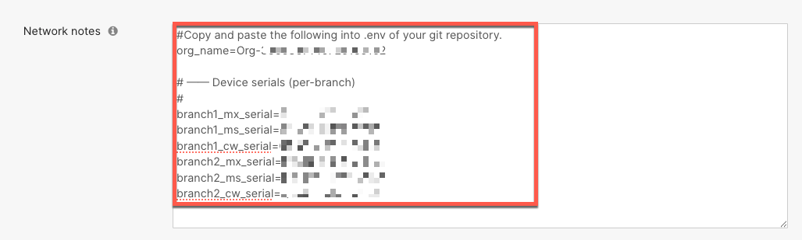

# Part B — Network as Code with Terraform (Optional)

In Part B, you will run Terraform directly from your local machine to deploy the same two Unified Branch networks you automated in Part A. This hands-on experience lets you inspect and modify the NaC data model, run `terraform plan` and `terraform apply` interactively, and understand what the CI/CD pipeline does under the hood.

!!! warning "Pre-requisite — Environment Must Be Clean"
    Part A deployed **Unified Branch 1** and **Unified Branch 2** via the CI/CD pipeline. Terraform stores state in the pipeline — your local machine does not have that state file.

    Before starting Part B, run the **Cleanup – Delete Branch Networks** workflow in GitHub Actions to remove both branch networks. If you have not done this yet, follow the cleanup steps at the end of **[Part A](PART-A-CICD.md)**. Your local `terraform apply` must start from a clean slate — no existing **Unified Branch 1** or **Unified Branch 2** networks in the org.

---

## Learning Objectives

By the end of Part B, you will be able to:

- Use git to clone the Network as Code lab repository and configure a local `.env` file
- Understand the NaC YAML data model — pods variables, templates, and the `!env` tag
- Use Terraform to merge YAML files into a rendered configuration
- Run `terraform plan` to preview changes before applying
- Use `terraform apply` to deploy branch networks and claim physical hardware
- Verify the deployed configuration in the Meraki Dashboard

---

## Local Prerequisites

Make sure you have the following installed before starting:

| Tool | Minimum Version | Install |
|------|----------------|---------|
| **Terraform** | 1.9 or later | [developer.hashicorp.com/terraform/downloads](https://developer.hashicorp.com/terraform/downloads) |
| **Git** | Any recent version | [git-scm.com](https://git-scm.com) |
| **Python** | 3.11 or later | [python.org](https://www.python.org/downloads/) |

Verify installations:

```bash
terraform version   # Expected: Terraform v1.9.x or later
git --version
python3 --version   # Expected: Python 3.11.x or later
```

!!! tip "Installation hints by OS"
    === "macOS"
        ```bash
        brew install terraform git python
        ```

    === "Linux (Debian / Ubuntu)"
        ```bash
        # Terraform
        sudo apt-get update && sudo apt-get install -y gnupg software-properties-common
        wget -O- https://apt.releases.hashicorp.com/gpg | sudo gpg --dearmor -o /usr/share/keyrings/hashicorp-archive-keyring.gpg
        echo "deb [signed-by=/usr/share/keyrings/hashicorp-archive-keyring.gpg] https://apt.releases.hashicorp.com $(lsb_release -cs) main" | sudo tee /etc/apt/sources.list.d/hashicorp.list
        sudo apt-get update && sudo apt-get install -y terraform

        # Git and Python
        sudo apt-get install -y git python3 python3-pip
        ```

    === "Windows"
        Install with [Chocolatey](https://chocolatey.org/) (run in an elevated PowerShell):
        ```powershell
        choco install terraform git python -y
        ```
        Or download installers manually:

        - Terraform: [https://developer.hashicorp.com/terraform/install](https://developer.hashicorp.com/terraform/install)
        - Git: [https://git-scm.com/download/win](https://git-scm.com/download/win)
        - Python: [https://www.python.org/downloads/windows](https://www.python.org/downloads/windows)

<!-- Internal note: Linux and Windows installation steps to be validated  -->
---

## Step 1 — Verify the Environment Is Clean

Before cloning, confirm that **Unified Branch 1** and **Unified Branch 2** do **not** exist in your Meraki lab organization.

1. Open [https://dashboard.meraki.com](https://dashboard.meraki.com) and navigate to your lab organization.

2. Check the network selector — only the **Datacenter** network should be present.

    !!! danger "Important"
        If **Unified Branch 1** or **Unified Branch 2** still exist, run the **Cleanup – Delete Branch Networks** workflow in GitHub Actions before proceeding. Follow the cleanup steps at the end of **[Part A](PART-A-CICD.md)**. Running `terraform apply` locally against an org that already has those networks — but no local state file — will cause errors.

3. Select the **Datacenter** network, then navigate to **Network-wide > General**. Copy the value in the **Network notes** field — you will need it in Step 2.
    
---

## Step 2 — Configure Your Local Environment

1. Open a terminal and clone the repository:

    ```bash
    git clone [Unified Branch - Network as Code public repo]
    cd bac-lab
    ```

2. Copy the environment variable template:

    ```bash
    cp .env.example .env
    ```

3. Open `.env` in your editor. Paste the value from Step 1 and replace the following lines. 

    ``` { .bash .no-copy }
    org_name=Org-XXXXXXXXXXXXXXXXXXX

    # ── Device serials (per-branch)
    #
    branch1_mx_serial=XXXX-XXXX-XXXX
    branch1_ms_serial=XXXX-XXXX-XXXX
    branch1_cw_serial=XXXX-XXXX-XXXX
    branch2_mx_serial=XXXX-XXXX-XXXX
    branch2_ms_serial=XXXX-XXXX-XXXX
    branch2_cw_serial=XXXX-XXXX-XXXX
    ```
4. Still in `.env`, add the following line and paste in your Meraki API key. Use the [same key you generated in Part A — Step 5](PART-A-CICD.md#step-5-generate-your-meraki-api-key). Save `.env` file.

    ```bash
    MERAKI_API_KEY=[PASTE YOUR DASHBOARD API KEY HERE]
    ```

5. Export all variables from `.env` into your current shell session:

    ```bash
    set -a && source .env && set +a
    ```

    !!! info "Why `set -a`?"
        A plain `source .env` sets variables as **shell-local** only — builtins like `echo` can read them, but child processes like `terraform` cannot. `set -a` (allexport) tells the shell to automatically **export** every assignment as a proper environment variable, making them visible to any program launched from this session. `set +a` turns allexport off again afterward.

6. Verify that the variables are correctly exported:

    ```bash
    echo "Org:              $org_name"
    echo "API key set:      $([ -n "$MERAKI_API_KEY" ] && echo yes || echo NO)"
    echo "Branch 1 MX:      $branch1_mx_serial"
    echo "Branch 2 MX:      $branch2_mx_serial"
    # Confirm variables are exported (visible to child processes)
    env | grep org_name
    ```

    !!! danger "Important"
        The `.env` file is listed in `.gitignore` and will **not** be committed to Git. Never add it manually to version control — it contains your API key.

    !!! warning "Note"
        If you see `environment variable not set` errors later, re-run `set -a && source .env && set +a` in the **same terminal** you will use for Terraform. Variables only persist for the current shell session — opening a new tab starts fresh.

---

## Step 3 — Understand the Data Model

Before running Terraform, spend a few minutes reading through the data model files.

Open `data/pods_variables.nac.yaml`. This is the **source of truth** for your branch network configuration — a YAML file that describes the desired state of your Meraki networks declaratively.

Key things to notice:

```yaml
meraki:
  domains:
    - name: US                        # hardcoded domain — matches your Meraki org region
      administrator:
        name: admin                   # org-level admin account name
      organizations:
        - name: !env org_name         # reads org name from your .env at runtime
          networks:
            - name: Unified Branch 1
              templates: [nw_setup, nw_management, app_ports, switch,
                          small_branch_inventory, wan_dhcp_dhcp, wireless,
                          app_settings, app_spoke, app_vlans, app_fw, app_ts,
                          app_content, app_intrusion, app_mal,
                          app_static_routes, group_policies]
              variables:
                appliance_01_name: Unified Branch Network 1 Appliance
                appliance_01_serial: !env branch1_mx_serial    # claims the MX85
                access_switch_01_name: Unified Branch Network 1 Switch
                access_switch_01_serial: !env branch1_ms_serial  # claims the MS250
                ap_01_name: Unified Branch Network 1 Access Point
                ap_01_serial: !env branch1_cw_serial           # claims the CW9172H
                vlan10_subnet: 10.1.10.0/24
                vlan10_appliance_ip: 10.1.10.1
                vlan20_subnet: 10.1.20.0/24
                vlan20_appliance_ip: 10.1.20.1
                # ... more VLANs and settings ...
                hub_network_name: !env vpn_hub_network_name    # VPN hub reference
                time_zone: America/Los_Angeles
                wan1_limit_down: 400000                        # kbps
                wan1_limit_up: 400000

            - name: Unified Branch 2
              templates: [...]        # same template list as Branch 1
              variables:
                appliance_01_serial: !env branch2_mx_serial
                # ... Branch 2 uses 10.2.x.x subnets ...

            - name: !env vpn_hub_network_name
              managed: false          # Datacenter is reference-only — never modified
```

| Key | What it means |
|-----|--------------|
| `!env <name>` | Reads a value from an environment variable at runtime — keeps secrets out of the file |
| `templates: [...]` | References reusable config blocks defined in `data/templates-*.nac.yaml` |
| `variables: {...}` | Per-branch values substituted into templates at apply time |
| `appliance_01_serial: !env ...` | Device serials injected at runtime — devices are claimed into the network |
| `managed: false` (Datacenter) | Reference-only — Terraform reads it for VPN hub config but will never modify or delete it |

Also explore the template files:

| File | What it configures |
|------|--------------------|
| `templates-appliance.nac.yaml` | MX VLANs, firewall rules, static routes, VPN, content filtering |
| `templates-network-related.nac.yaml` | Time zone, syslog, SNMP, group policies |
| `templates-switch.nac.yaml` | Switch port profiles, QoS, access policies |
| `templates-wireless.nac.yaml` | SSIDs, RF profiles, bandwidth shaping |
| `templates-inventory.nac.yaml` | Device onboarding and switch port inventory |
| `templates-wan-uplinks.nac.yaml` | WAN uplink configurations |

!!! info "Information"
    Learn more about the NaC framework at [github.com/netascode/terraform-meraki-nac-meraki](https://github.com/netascode/terraform-meraki-nac-meraki){:target="_blank"}.

---

## Step 4 — Render the Merged Configuration

The first Terraform run merges all YAML data files into a single rendered configuration. This is a **local-only** operation — no Meraki API calls are made.

1. Navigate to the `workspaces/` directory:

    ```bash
    cd workspaces
    ```

2. Initialize Terraform:

    ```bash
    terraform init
    ```

    Expected output (truncated):

    ``` { .bash .no-copy }
    Initializing modules...
    Downloading git::https://github.com/netascode/terraform-meraki-nac-meraki.git//modules/model?ref=v0.5.0 for model...
    Terraform has been successfully initialized!
    ```

3. Apply to render:

    ```bash
    terraform apply
    ```

    Type `yes` when prompted. Expected output:

    ``` { .bash .no-copy }
    Apply complete! Resources: 2 added, 0 changed, 0 destroyed.
    ```

    !!! tip "Hint"
        Open `workspaces/merged_configuration.nac.yaml` in your editor. This is the fully-rendered configuration — all `!env` tags have been resolved and all template variables substituted. Compare it to the individual source files to see how the merge works.

---

## Step 5 — Plan and Deploy to Meraki

Now run Terraform from the root of the project to deploy the branch networks.

1. Return to the root directory:

    ```bash
    cd ..
    ```

2. Initialize Terraform:

    ```bash
    terraform init
    ```

    Expected output (truncated):

    ``` { .bash .no-copy }
    Downloading git::https://github.com/netascode/terraform-meraki-nac-meraki.git?ref=v0.5.0 for meraki...
    Terraform has been successfully initialized!
    ```

3. Preview the changes:

    ```bash
    terraform plan
    ```

    Review the plan output. You should see resources being created for both branch networks:

    - `meraki_network` — the network itself
    - `meraki_network_device_claim` — claims MX85, MS250, CW9172H
    - `meraki_appliance_vlans`, `meraki_appliance_firewall_*` — appliance config
    - `meraki_switch_*` — switch port profiles and MTU
    - `meraki_wireless_*` — SSIDs and RF profiles
    - `meraki_network_group_policies`, `meraki_network_syslog_servers`, and more

    !!! info "Information"
        `terraform plan` is read-only — it calls the Meraki API to check current state but makes no changes. It is always safe to run.

4. Apply the configuration:

    ```bash
    terraform apply
    ```

    Type `yes` when prompted.

    !!! warning "Note"
        `terraform apply` may take **3–7 minutes** to complete depending on the number of resources. Do not interrupt the process.

    Expected final line:

    ``` { .bash .no-copy }
    Apply complete! Resources: N added, 0 changed, 0 destroyed.
    ```

---

## Step 6 — Verify in the Meraki Dashboard

1. Return to [https://dashboard.meraki.com](https://dashboard.meraki.com) in your lab organization.

2. In the network selector, confirm **Unified Branch 1** and **Unified Branch 2** now appear.

3. Select **Unified Branch 1** and verify:
    - **Network-wide > General** — time zone and address match `pods_variables.nac.yaml`
    - **Security & SD-WAN > Addressing & VLANs** — Data (10), Voice (20), IoT (30), Guest (50), and Infra (999) VLANs present
    - **Wireless > SSIDs** — Data and Guest SSIDs configured
    - **Security & SD-WAN > VPN Status** — the **Datacenter** remote peer should show green
    - **Security & SD-WAN > Appliance Status**, then navigate to **Tools > Ping**, configure the following and click **Ping**. You should see successful replies, confirming the VPN tunnel is up between the branch and Datacenter.
        - Source IP Address: `VLAN 10`
        - Destination IP Address: `10.255.20.1` (Gateway IP for Voice VLAN on the Datacenter side)

    !!! note
        VPN connectivity between branch networks and Datacenter may take a couple of minutes to establish after `terraform apply` completes.

4. Check **Organization > Inventory** to confirm MX85, MS250, and CW9172H for both branches are claimed and assigned to the correct networks.

    !!! tip "Hint"
        Navigate to **Organization > Change Log** to see the full API call log. You will see `POST api/v1/networks/{id}/devices/claim` alongside all the configuration calls — exactly what Terraform executed on your behalf.

    !!! tip "Hint"
        Run `terraform plan` again after `terraform apply` completes. It should report `No changes` — confirming the deployed state matches the data model exactly. This is what the Idempotency Test checks in Part A's CI/CD pipeline.

---

## Part B Complete!

You have:

- Run the cleanup workflow to reset the environment before the local Terraform run
- Configured a local `.env` file with your API key and branch serial numbers
- Explored the NaC YAML data model — pods variables, templates, the `!env` tag, and device claiming
- Used Terraform locally to render, plan, and deploy two fully-configured Unified Branch networks
- Established the Auto-VPN between branches and datacenter networks and verified the connectivity by running ping test
- Verified the deployed configuration in the Meraki Dashboard

!!! info "Keep Learning"
    - [Cisco Unified Branch CVD](https://www.cisco.com/c/en/us/td/docs/solutions/CVD/Campus/Cisco_Unified_Branch_Small_Branch.html){:target="_blank"}
    - [NetasCode — Branch as Code overview](https://netascode.cisco.com/docs/guides/branch/00_overview/){:target="_blank"}
    - [NetasCode Terraform Meraki NaC module](https://github.com/netascode/terraform-meraki-nac-meraki){:target="_blank"}
    - [Meraki Dashboard API documentation](https://developer.cisco.com/meraki/api-v1/){:target="_blank"}
    - [Terraform getting started guide](https://developer.hashicorp.com/terraform/tutorials){:target="_blank"}
    - [Launchpad Labs support and feedback](https://forms.office.com/pages/responsepage.aspx?id=Yq_hWgWVl0CmmsFVPveEDqZwHlbHP1tPs2fek7CZohFUNFlBMTZQWVZLV1BSSTIyOFIySVZQVk00SS4u){:target="_blank"}
